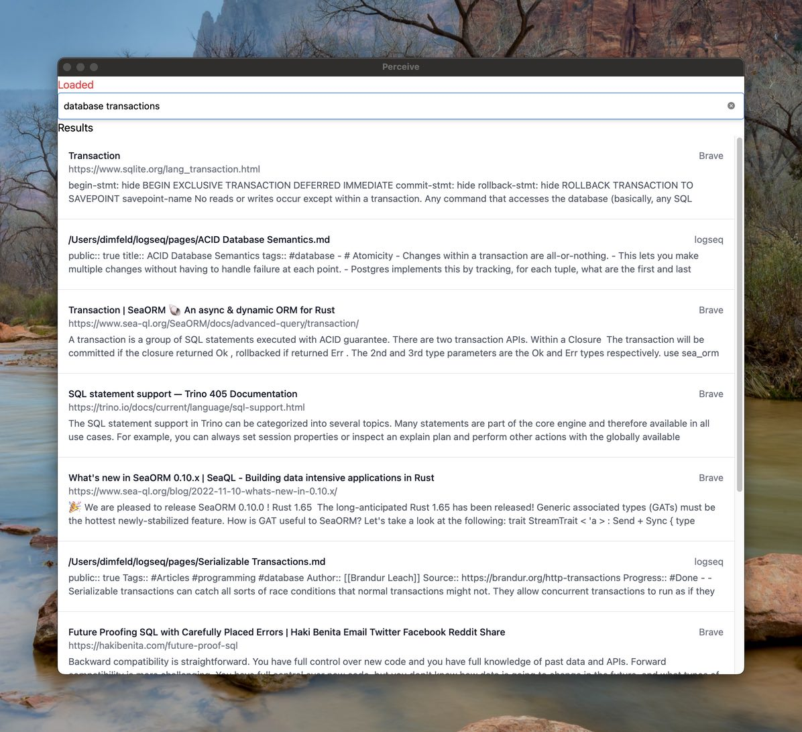

# perceive
Semantic search for your life

Perceive is a side project which I started to become more familiar with ML embeddings and semantic search. It has the ability to import
browser history and filesystem sources, and index them for searching.

## Features

- Read browser history and fetch the content
- Import bookmarks from Chrome
- Scan the local filesystem and index text files
- Supports multiple sources at once
- All indexing happens locally -- no need to send your data to someone else's server

## Adding Sources

The browser history and bookmark source types use the Chromium browser directory as the location. For Brave Browser on
macOS this is ` ~/Library/Application\ Support/BraveSoftware/Brave-Browser/Default`. Other Chromium-based browsers will
have similar locations.

## Future Features

- Bookmark management
- More UI work
- Better article content extraction
- Browser extension for better page capture

## Installation

As of now there is no prepackaged binary with everything included.

First, you'll want to run `just install-models`, using [just](https://github.com/casey/just). This will download the 
model from Huggingface and convert it to the format used by Rust's version of Torch.

### Building on macOS

You'll need to have libtorch installed. You can use `pip3` or `homebrew` to install `pytorch`, and then
set the LIBTORCH environment variable to the path where libtorch is installed.

For example, when installed via homebrew you would add `export LIBTORCH=/opt/homebrew/opt/pytorch` to your `~/.zshrc` or
`~/.zprofile`.

At some point I'll try to add some better way of installing a local copy too, to make it easier to match the version of
libtorch with the version expected by the bindings.
